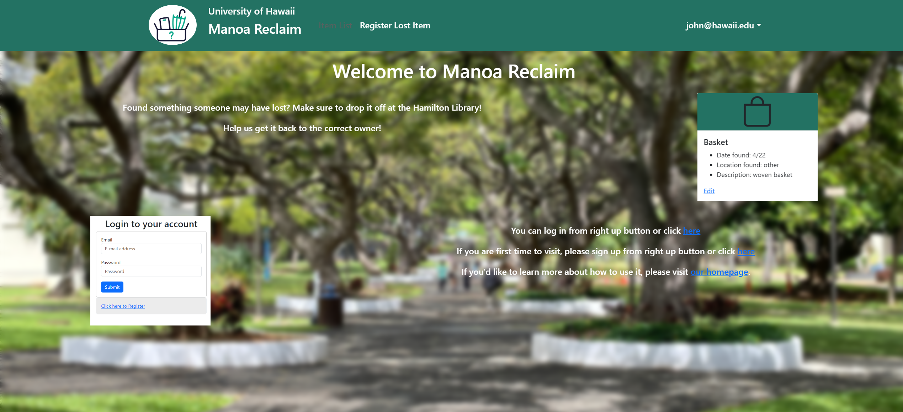
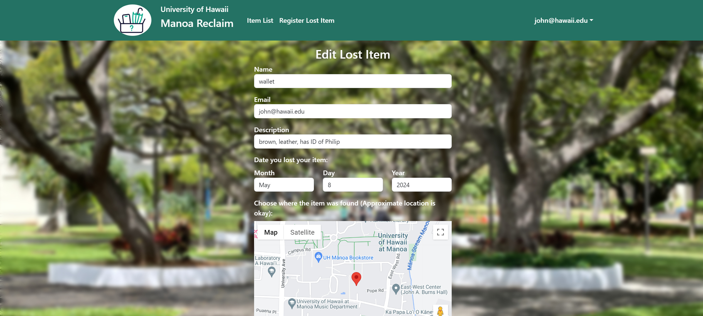

# Manoa Reclaim

## Table of contents

* [Overview](#overview)
* [User Guide](#user-guide)
* [Developer Guide](#developer-guide)
* [Deployment Guide](#deployment-guide)
* [Deployment](#deployment)
* [Projects](#project-pages)
* [Team](#team)
* [Continuous Integration](#continuous-integration)
* [Mockup pages](#mockup-pages)
* [Feedback](#community-feedback)

## Project Pages

[Milestone 1](https://github.com/orgs/manoa-reclaim/projects/1)  

[Milestone 2](https://github.com/orgs/manoa-reclaim/projects/2)

[Milestone 3](https://github.com/orgs/manoa-reclaim/projects/3)

## Deployment


[Check out our website](https://manoareclaim.online/)

## Overview

The Manoa Reclaim web app simplifies returning lost items like wallets and phones to their owners. It features lists of lost and found items, including their locations. Users can post lost items and browse these lists. Found items placed in specific areas, such as the Campus Center and ID Office, can have messaging disabled to streamline the recovery process. Manoa Reclaim allows people to quickly find items lost on campus and allows people to easily turn in items they find.

## Mockup Pages


## User Guide

This section provides a walkthrough of the Manoa Reclaim user interface and its capabilities.

### Landing Page

Here is the landing page for Manoa Reclaim.


### Sign In and Sign Up

Click on the "Login" button in the upper right corner of the navbar, then select "Sign in" to go to the following page and login. You must have been previously registered with the system to use this option:


Alternatively, you can select "Sign up" to go to the following page and register as a new user. When registering on this page, we kindly request that you use a University of Hawaii email address. Only UH email addresses are accepted and cannot accommodate other email domains.


### Home page

After logging in, you are taken to the home page, which presents a form where you can register or edit your lost items and show the list of these items:



### Register Lost Item Page

Once you are logged in, you will find the form to register your lost item conveniently located at the navigation bar on top. You can register your lost item with some informations such as the name or type of the item, the date and location where it was lost, your contact email for when it is found, and any additional descriptive details about the item.


It also has a map so you can pin a google map to indicate in detail where you found it.


### List item page

You can show the list of your lost items in List item page 


### Edit page

In list items, There have edit button.
if you want to change the information of your lost item, you can edit from edit button.



## Developer Guide

This section provides information of interest to Meteor developers wishing to use this code base as a basis for their own development tasks.

### Installation

First, [install Meteor](https://www.meteor.com/install).

Then, view the [Project Github](https://github.com/manoa-reclaim/Manoa-reclaim-app), and click the “Code” button. 

Click the “Code” button and “Download Zip” to download the project to your local system.


Now unzip the file and use it to create a new project in your IDE of choice.

Then, cd into the app/ directory of your local copy of the project, and install third party libraries with:


### Running The System

Once the libraries are installed, you can run the application by invoking the “start” script in the package.json file:

Run the system with:

meteor npm run start


### Viewing the app

Go to https://localhost:3000 to see the app. If you’ve done these steps correctly, the application should now appear.


### Data model

The Manoa Reclaim data model consists of two "primary" collections Lost Items and Users. To understand this design choice, consider the situation where you want to specify the location, date, and description of the lost item associated with a name of the lost item.

1. **Lost Item Collection:**
   - Attributes:
     - Name of the lost item
     - Date item was lost
     - Location of lost item
     - Description of lost item
   - Description: This collection stores information about each lost item, including its name, when it was lost, where it was lost, and a description.

2. **Users Collection:**
   - Attributes:
     - User profiles
       - User name
       - Email
       - Other relevant details
   - Description: Profiles represent users who interact with the system, such as those who report lost items or search for them.

## Initialization

The [config](https://github.com/manoa-reclaim/Manoa-reclaim-app/tree/main/config) directory is intended to hold settings files.  The repository contains one file: [config/settings.development.json](https://github.com/manoa-reclaim/Manoa-reclaim-app/blob/main/config/settings.development.json).

The settings.development.json file contains a field called "loadAssetsFile". It is set to false, but if you change it to true, then the data in the file app/private/data.json will also be loaded.  The code to do this illustrates how to initialize a system when the initial data exceeds the size limitations for the settings file.

### Setting up IntelliJ and ESLint

Make sure that ESLint is configured correctly. Open a Javascript file such as imports/startup/client/startup.jsx. To test that ESLint is working, add 3-4 blank lines to the bottom of the file. An ESLint error should now be displayed in the right margin in red. Now delete them, and a green checkmark should reappear.

#### ESLint

Manoa reclaim includes a [.eslintrc](https://github.com/manoa-reclaim/Manoa-reclaim-app/blob/main/app/.eslintrc.js) file to define the coding style adhered to in this application. You can invoke ESLint from the command line as follows:

```
meteor npm run lint
```

Here is sample output indicating that no ESLint errors were detected:

```
$ meteor npm run lint

> meteor-application-template-react@ lint /Users/user1/GitHub/Manoa-reclaim-app/app
> eslint --quiet --ext .jsx --ext .js ./imports ./tests

$
```

ESLint should run without generating any errors.

It's significantly easier to do development with ESLint integrated directly into your IDE (such as IntelliJ).

## Deployment Guide

This section provides instructions for deploying the Manoa Reclaim application to a production environment.

### Deployment Platforms

Manoa Reclaim can be deployed to various hosting platforms, including Heroku, AWS (Amazon Web Services), DigitalOcean, and Galaxy (Meteor's hosting platform). Consider factors like scalability, pricing, and integration capabilities when selecting a platform. But in this case we are using [DigitalOcean](https://try.digitalocean.com/cloud/?utm_campaign=amer_brand_kw_en_cpc&utm_adgroup=Misspellings&_keyword=digitalocean%3A&_device=c&_adposition=&utm_content=conversion&utm_medium=cpc&utm_source=google&gad_source=1&gclid=Cj0KCQjwxeyxBhC7ARIsAC7dS3-zVp3qkRL4k3Pz_toEb6PQPB8l5M6Lik4Hy92sg2Wf3jyQamXDuTQaAnR5EALw_wcB).

### Deployment Preparation

Before deploying Manoa Reclaim, ensure that your local development environment is set up and the application is running smoothly. Verify that all dependencies are installed and up to date. Review and update any environment-specific configurations, such as database connections and API keys, to ensure smooth operation in the production environment.

### Deployment Methods

Choose a deployment method that best suits your workflow and platform requirements. Git-based deployments allow you to push changes to your deployment platform automatically. Containerization (Docker) enables you to package the application and its dependencies into containers for consistent deployment across environments. Alternatively, you can manually upload application files to the hosting platform via FTP or SSH.

### Database Setup

If your application relies on a database, ensure the database is configured correctly for the production environment. This may involve setting up database instances, configuring access permissions, and migrating or seeding data.

### Testing in Production

Thoroughly test the deployed application in the production environment to ensure functionality and performance. Conduct both manual and automated tests to validate deployment success.

### Application Design

Manoa Reclaim is based upon [meteor-application-template-react](https://ics-software-engineering.github.io/meteor-application-template-react/) and [meteor-example-form-react](https://ics-software-engineering.github.io/meteor-example-form-react/). Please use the videos documentation at those sites to better acquaint yourself with the basic application design and form processing in Manoa Reclaim.

## Community Feedback

We are interested in your experience using Manoa Reclaim!  If you would like, please take a couple of minutes to fill out the [Manoa Reclaim Feedback Form](https://forms.gle/ENMoUUXgzrRJesTP6). It contains only four short questions and will help us understand how to improve the system. Thank you!

_______________________________________________________________________

<p>Question: How was your experience using our website?</p>
<p>From our handfull of respondants, the majority of uers rated our website with an average overall experience with a few exceptions, some of which stated a rating of "okay" and another rating it "very good"<p>


<p>Question: Suggestions on what we should add to our website?</p>
<p>A few respondants stated the importance of being able to view pictures, while another would have liked to have a more interesting and creative design and layout to the website.<p>


<p>Question: Were there any bugs encountered while using our website?</p>
<p>A few users expressed confusion on the initial account registration and sign-in step of the website, stating a few steps seemed to have needed repeated action. Other users expressed no such issues.</p>

<p>Question: Other concerns or questions?</p>
<p>Responses varied from a lack of images, to the justification and alignment of text, and also issues signing in/registering</p>

<!-- READ HERE: THE FOLLOWING IS AN EXAMPLE FROM BOWFOLIOS AND IS COMMENTED OUT UNTIL MORE UPDATES ARE MADE

## Community Feedback

We are interested in your experience using Bowfolio!  If you would like, please take a couple of minutes to fill out the [Bowfolios Feedback Form](https://forms.gle/hBHdccQEbm4YNfPd6). It contains only five short questions and will help us understand how to improve the system.

## Developer Guide

This section provides information of interest to Meteor developers wishing to use this code base as a basis for their own development tasks.

### Installation

First, [install Meteor](https://www.meteor.com/install).

Second, visit the [Bowfolios application github page](https://github.com/bowfolios/bowfolios), and click the "Use this template" button to create your own repository initialized with a copy of this application. Alternatively, you can download the sources as a zip file or make a fork of the repo.  However you do it, download a copy of the repo to your local computer.

Third, cd into the bowfolios/app directory and install libraries with:

```
$ meteor npm install
```

Fourth, run the system with:

```
$ meteor npm run start
```

If all goes well, the application will appear at [http://localhost:3000](http://localhost:3000).

### Application Design

Bowfolios is based upon [meteor-application-template-react](https://ics-software-engineering.github.io/meteor-application-template-react/) and [meteor-example-form-react](https://ics-software-engineering.github.io/meteor-example-form-react/). Please use the videos and documentation at those sites to better acquaint yourself with the basic application design and form processing in Bowfolios.

### Data model

As noted above, the Bowfolios data model consists of three "primary" collections (Projects, Profiles, and Interests), as well as three "join" Collections (ProfilesProjects, ProfilesInterests, and ProjectsInterests).  To understand this design choice, consider the situation where you want to specify the projects associated with a Profile.

Design choice #1: Provide a field in Profile collection called "Projects", and fill it with an array of project names. This choice works great when you want to display a Profile and indicate the Projects it's associated with.  But what if you want to go the other direction: display a Project and all of the Profiles associated with it?  Then you have to do a sequential search through all of the Profiles, then do a sequential search through that array field looking for a match.  That's computationally expensive and also just silly.

Design choice #2:  Provide a "join" collection where each document contains two fields: Profile name and Project name. Each entry indicates that there is a relationship between those two entities. Now, to find all the Projects associated with a Profile, just search this collection for all the documents that match the Profile, then extract the Project field. Going the other way is just as easy: to find all the Profiles associated with a Project, just search the collection for all documents matching the Project, then extract the Profile field.

Bowfolios implements Design choice #2 to provide pair-wise relations between all three of its primary collections:


The fields in boldface (Email for Profiles, and Name for Projects and Interests) indicate that those fields must have unique values so that they can be used as a primary key for that collection. This constraint is enforced in the schema definition associated with that collection.


## Initialization

The [config](https://github.com/bowfolios/bowfolios/tree/main/config) directory is intended to hold settings files.  The repository contains one file: [config/settings.development.json](https://github.com/bowfolios/bowfolios/blob/main/config/settings.development.json).

This file contains default definitions for Profiles, Projects, and Interests and the relationships between them. Consult the walkthrough video for more details.

The settings.development.json file contains a field called "loadAssetsFile". It is set to false, but if you change it to true, then the data in the file app/private/data.json will also be loaded.  The code to do this illustrates how to initialize a system when the initial data exceeds the size limitations for the settings file.


### Quality Assurance

#### ESLint

BowFolios includes a [.eslintrc](https://github.com/bowfolios/bowfolios/blob/main/app/.eslintrc) file to define the coding style adhered to in this application. You can invoke ESLint from the command line as follows:

```
meteor npm run lint
```

Here is sample output indicating that no ESLint errors were detected:

```
$ meteor npm run lint

> bowfolios@ lint /Users/philipjohnson/github/bowfolios/bowfolios/app
> eslint --quiet --ext .jsx --ext .js ./imports ./tests

$
```

ESLint should run without generating any errors.

It's significantly easier to do development with ESLint integrated directly into your IDE (such as IntelliJ).

#### End to End Testing

BowFolios uses [TestCafe](https://devexpress.github.io/testcafe/) to provide automated end-to-end testing.

The BowFolios end-to-end test code employs the page object model design pattern.  In the [bowfolios tests/ directory](https://github.com/bowfolios/bowfolios/tree/main/app/tests), the file [tests.testcafe.js](https://github.com/bowfolios/bowfolios/blob/main/app/tests/tests.testcafe.js) contains the TestCafe test definitions. The remaining files in the directory contain "page object models" for the various pages in the system (i.e. Home, Landing, Interests, etc.) as well as one component (navbar). This organization makes the test code shorter, easier to understand, and easier to debug.

To run the end-to-end tests in development mode, you must first start up a BowFolios instance by invoking `meteor npm run start` in one console window.

Then, in another console window, start up the end-to-end tests with:

```
meteor npm run testcafe
```

You will see browser windows appear and disappear as the tests run.  If the tests finish successfully, you should see the following in your second console window:

```
$ meteor npm run testcafe

> bowfolios@ testcafe /Users/philipjohnson/github/bowfolios/bowfolios/app
> testcafe chrome tests/*.testcafe.js

 Running tests in:
 - Chrome 86.0.4240.111 / macOS 10.15.7

 Bowfolios localhost test with default db
 ✓ Test that landing page shows up
 ✓ Test that signin and signout work
 ✓ Test that signup page, then logout works
 ✓ Test that profiles page displays
 ✓ Test that interests page displays
 ✓ Test that projects page displays
 ✓ Test that home page display and profile modification works
 ✓ Test that addProject page works
 ✓ Test that filter page works


 9 passed (40s)

 $
```

You can also run the testcafe tests in "continuous integration mode".  This mode is appropriate when you want to run the tests using a continuous integration service like Jenkins, Semaphore, CircleCI, etc.  In this case, it is problematic to already have the server running in a separate console, and you cannot have the browser window appear and disappear.

To run the testcafe tests in continuous integration mode, first ensure that BowFolios is not running in any console.

Then, invoke `meteor npm run testcafe-ci`.  You will not see any windows appear.  When the tests finish, the console should look like this:

```
$ meteor npm run testcafe-ci

> bowfolios@ testcafe-ci /Users/philipjohnson/github/bowfolios/bowfolios/app
> testcafe chrome:headless tests/*.testcafe.js -q --app "meteor npm run start"

 Running tests in:
 - Chrome 86.0.4240.111 / macOS 10.15.7

 Bowfolios localhost test with default db
 ✓ Test that landing page shows up (unstable)
 ✓ Test that signin and signout work
 ✓ Test that signup page, then logout works
 ✓ Test that profiles page displays
 ✓ Test that interests page displays
 ✓ Test that projects page displays
 ✓ Test that home page display and profile modification works
 ✓ Test that addProject page works
 ✓ Test that filter page works


 9 passed (56s)

$
```

All the tests pass, but the first test is marked as "unstable". At the time of writing, TestCafe fails the first time it tries to run a test in this mode, but subsequent attempts run normally. To prevent the test run from failing due to this problem with TestCafe, we enable [testcafe quarantine mode](https://devexpress.github.io/testcafe/documentation/guides/basic-guides/run-tests.html#quarantine-mode).

The only impact of quarantine mode should be that the first test is marked as "unstable".

## From mockup to production

Bowfolios is meant to illustrate the use of Meteor for developing an initial proof-of-concept prototype.  For a production application, several additional security-related changes must be implemented:

* Use of email-based password specification for users, and/or use of an alternative authentication mechanism.
* Use of https so that passwords are sent in encrypted format.
* Removal of the insecure package, and the addition of Meteor Methods to replace client-side DB updates.

(Note that these changes do not need to be implemented for ICS 314, although they are relatively straightforward to accomplish.)

## Continuous Integration


BowFolios uses [GitHub Actions](https://docs.github.com/en/free-pro-team@latest/actions) to automatically run ESLint and TestCafe each time a commit is made to the default branch.  You can see the results of all recent "workflows" at [https://github.com/bowfolios/bowfolios/actions](https://github.com/bowfolios/bowfolios/actions).

The workflow definition file is quite simple and is located at
[.github/workflows/ci.yml](https://github.com/bowfolios/bowfolios/blob/main/.github/workflows/ci.yml).

## Development History

The development process for BowFolios conformed to [Issue Driven Project Management](http://courses.ics.hawaii.edu/ics314f19/modules/project-management/) practices. In a nutshell:

* Development consists of a sequence of Milestones.
* Each Milestone is specified as a set of tasks.
* Each task is described using a GitHub Issue, and is assigned to a single developer to complete.
* Tasks should typically consist of work that can be completed in 2-4 days.
* The work for each task is accomplished with a git branch named "issue-XX", where XX is replaced by the issue number.
* When a task is complete, its corresponding issue is closed and its corresponding git branch is merged into master.
* The state (todo, in progress, complete) of each task for a milestone is managed using a GitHub Project Board.

The following sections document the development history of BowFolios.

### Milestone 1: Mockup development

The goal of Milestone 1 was to create a set of HTML pages providing a mockup of the pages in the system.

Milestone 1 was managed using [BowFolio GitHub Project Board M1](https://github.com/bowfolios/bowfolios/projects/1):


### Milestone 2: Data model development

The goal of Milestone 2 was to implement the data model: the underlying set of Mongo Collections and the operations upon them that would support the BowFolio application.

Milestone 2 was managed using [BowFolio GitHub Project Board M2](https://github.com/bowfolios/bowfolios/projects/2):


## Milestone 3: Final touches

The goal of Milestone 3 was to clean up the code base and fix minor UI issues.

Milestone 3 was managed using [BowFolio GitHub Project Board M3](https://github.com/bowfolios/bowfolios/projects/3):


As of the time of writing, this screenshot shows that there is an ongoing task (i.e. this writing).

## Walkthrough videos

BowFolios is intended as a model of how an ICS 314 project could be organized and executed. Here are videos that walk you through various aspects of the system:

* [BowFolios Part 1: Application Overview (5 min)](https://www.youtube.com/watch?v=5lXSLf9VHqw)
* [BowFolios Part 2: Application Structure and Control Flow (14 min)](https://www.youtube.com/watch?v=hQYc8UK4K7w)
* [BowFolios Part 3: Data Model, Data Initialization, Publications and Subscriptions (27 min)](https://www.youtube.com/watch?v=pcZg_44Ssdk)
* [BowFolios Part 4: Forms and Meteor Methods (20 min)](https://www.youtube.com/watch?v=TLavamIYaEc)
* [BowFolios Part 5: Loading data using Assets (8 min)](https://www.youtube.com/watch?v=NzrTzBPCJPo)
* [BowFolios Part 6: End-to-End testing in BowFolios (24 min)](https://www.youtube.com/watch?v=B8TSiCLBeaA)

## Example enhancements

There are a number of simple enhancements you can make to the system to become better acquainted with the codebase:

* Display an email icon that links to a mailto: for each user in the profile page.
* Display the home page for each project as a home icon. Click on it to visit the Project's home page.
* Add social media accounts to the profile (facebook, twitter, instagram) and show the associated icon in the Profile.
* The system supports the definition of users with an Admin role, but there are no Admin-specific capabilities. Implement some Admin-specific functions, such as the ability to delete users or add/modify/delete Interests.
* There is no way to edit or delete a project definition. Add this ability.
* It would be nice for users to only be able to edit the Projects that they have created.  Add an "owner" field to the Project collection, and then only allow a user to edit a Project definition if they own it.
* The error message associated with trying to define a new Project with an existing Project name is uninformative. Try it out for yourself to see what happens. Fix this by improving the associated Meteor Method to "catch" errors of this type and re-throw with a more informative error message.
* The testcafe acceptance tests only test successful form submissions. Add a test in which you fill out a form incorrectly (perhaps omitting a required field) and then test to ensure that the form does not submit successfully.

-->


## Continuous Integration

Using GitHub actions we check all merge commits to our main codebase using tests we made.


## Team

Manoa Reclaim is designed, implemented, and maintained by Royce Cornwell, Cohen Ruport, Kai Sutton, Kaito Tateno and Austin Villanueva.

[Team Contract](https://docs.google.com/document/d/1ZnShNnfNbNHlyba_1sJoq1aYW9pQSs4oBMMc9CqqCX0/edit)
